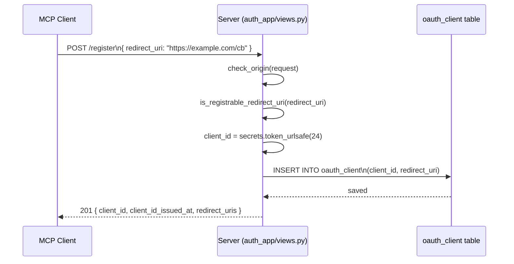
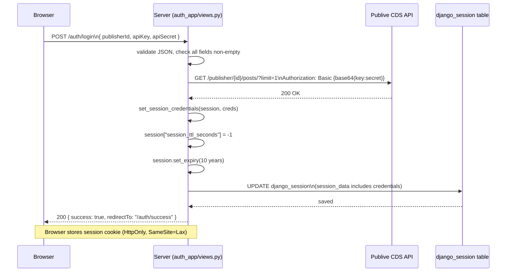
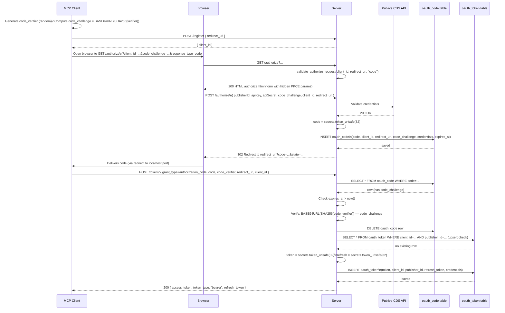
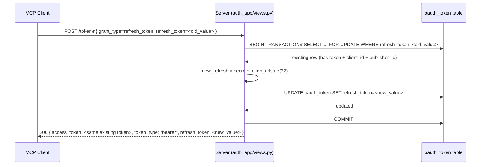
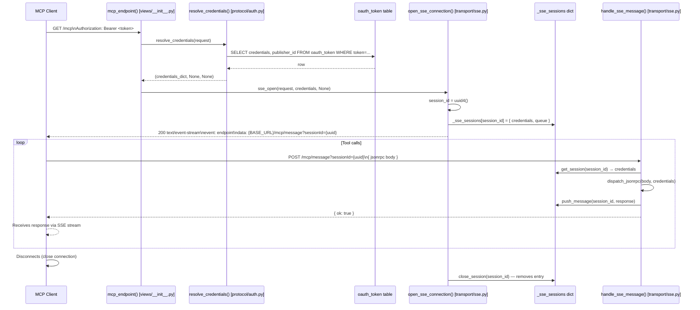
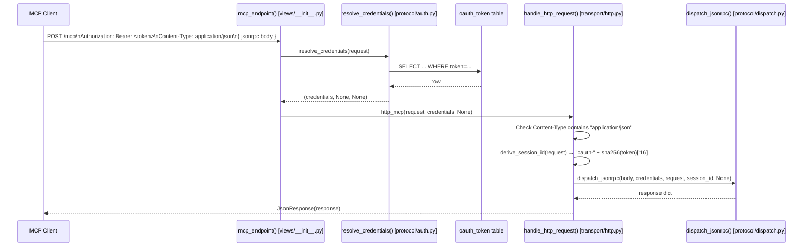

# auth.md — Complete Authentication & Authorization Reference

## Table of Contents

1. [Authentication Architecture Overview](#1-authentication-architecture-overview)
2. [Complete User Registration Flow](#2-complete-user-registration-flow)
3. [Login Flow (Session-based)](#3-login-flow-session-based)
4. [OAuth + PKCE Flow](#4-oauth--pkce-flow)
5. [Access Token & Refresh Token Flow](#5-access-token--refresh-token-flow)
6. [SSE Transport Authentication Flow](#6-sse-transport-authentication-flow)
7. [HTTP Transport Authentication Flow](#7-http-transport-authentication-flow)
8. [MCP Client → Server Authentication Flow](#8-mcp-client--server-authentication-flow)
9. [Database Deep Dive](#9-database-deep-dive)
10. [Middleware Analysis](#10-middleware-analysis)
11. [Authorization Logic](#11-authorization-logic)
12. [Session Management](#12-session-management)
13. [Error Handling Paths](#13-error-handling-paths)
14. [Complete Sequence Diagrams](#14-complete-sequence-diagrams)
15. [Source Code Traceability](#15-source-code-traceability)

---

## 1. Authentication Architecture Overview

- **Identity**: Who is calling — which `publisherId` owns this session?
- **Credential forwarding**: The MCP server must hold `publisherId`, `apiKey`, and `apiSecret` to forward downstream requests to the Publive API on behalf of that caller.

### Two Auth Flows

| Flow | Intended Caller | Entry Point | Token Issued |
|------|----------------|-------------|--------------|
| **OAuth 2.0 + PKCE** | API clients: Claude Desktop, Cursor, ChatGPT SDK | `GET /authorize` → `POST /token` | Bearer token (`OAuthToken`) |
| **Session-based** | Browser users at `/connect` page | `POST /auth/login` | Django session cookie |

### Why PKCE?

PKCE (Proof Key for Code Exchange, RFC 7636) prevents **authorization code interception attacks**. Native desktop apps (Claude Desktop, Cursor) receive the authorization code via a redirect to `http://localhost:<port>`. Any malicious process running on the same machine could register the same redirect URI and intercept the code. PKCE binds the code to the original requester:

1. The client generates a random `code_verifier` (never sent in the authorization request).
2. The client computes `code_challenge = BASE64URL(SHA256(code_verifier))` and sends only the challenge.
3. When exchanging the code for a token, the client sends the original `code_verifier`.
4. The server recomputes the challenge and compares — only the original client can produce the matching verifier.

This server enforces `S256` only. Plain (`code_challenge_method=plain`) is not advertised or validated.

### How MCP Clients Authenticate

```
MCP Client                         This Server
───────────                        ────────────
1. Discover metadata ──────────────► GET /.well-known/oauth-authorization-server
                    ◄────────────── Authorization + token endpoints advertised

2. Register client  ──────────────► POST /register
                    ◄────────────── { client_id }

3. Open auth form   ──────────────► GET /authorize?client_id=...&code_challenge=...
                    ◄────────────── HTML form (or redirect if pre-authorized)

4. Submit creds     ──────────────► POST /authorize (publisherId, apiKey, apiSecret)
                    ◄────────────── 302 → redirect_uri?code=...&state=...

5. Exchange code    ──────────────► POST /token (code, code_verifier)
                    ◄────────────── { access_token, refresh_token }

6. Call MCP tools   ──────────────► GET /mcp  Authorization: Bearer <token>
                    ◄────────────── SSE stream with endpoint URL

7. Send JSON-RPC    ──────────────► POST /mcp/message?sessionId=<uuid>
                    ◄────────────── { ok: true }  (response pushed over SSE)
```

### Auth Differences Between SSE and HTTP Transports

| Aspect | SSE Transport | HTTP Transport |
|--------|--------------|----------------|
| Trigger | `GET /mcp` | `POST /mcp` |
| Auth point | Once at connection open | Every request |
| Credential storage | In-memory `_sse_sessions` dict for session lifetime | Not stored; resolved per request |
| Session identity | UUID generated at connection time | SHA-256 of Bearer token prefix or Django session key |
| Credential re-check | Never after connection open | On every POST |
| Supports session cookie | Yes | Yes |

### All Security Mechanisms

1. **PKCE S256** — prevents code interception for native clients
2. **CDS credential validation** — credentials are verified against the Publive API before any token or session is issued
3. **Origin allowlist** (`check_origin`) — web OAuth requests must come from approved origins (Claude.ai, ChatGPT, Gemini, Copilot, Bing, same-origin)
4. **Redirect URI validation** — registered URI must be HTTPS or loopback; matching enforces exact match or same-loopback-host-any-port (RFC 8252)
5. **Authorization code TTL** — codes expire 10 minutes after issuance and are deleted on exchange (single-use)
6. **Rate limiting** — sliding-window caps per IP or token prefix on all auth and MCP endpoints
7. **CSRF exemption is explicit** — only endpoints that process machine-to-machine OAuth flows are `@csrf_exempt`; browser login forms use Django session state
8. **Session absolute TTL** — server-side TTL stored in the session prevents rolling cookie attacks; `SESSION_SAVE_EVERY_REQUEST = True` keeps the cookie fresh but the server-side deadline is authoritative
9. **Security response headers** — CSP, X-Frame-Options, nosniff, Referrer-Policy, Permissions-Policy on all HTML responses
10. **Atomic refresh token rotation** — `select_for_update()` inside `transaction.atomic()` prevents two simultaneous refresh requests from both succeeding

### Architecture Diagram

```mermaid
graph TB
    subgraph Clients
        A[Claude Desktop / Cursor]
        B[Web Browser]
        C[ChatGPT / Gemini SDK]
    end

    subgraph auth_app
        REG["/register\noauth_register()"]
        AUTH["/authorize\noauth_authorize()"]
        TOKEN["/token\noauth_token()"]
        REVOKE["/revoke\noauth_revoke()"]
        LOGIN["/auth/login\nauth_login()"]
        STATUS["/auth/status\nauth_status()"]
        LOGOUT["/auth/logout\nauth_logout()"]
        USERINFO["/userinfo\noauth_userinfo()"]
        META["/.well-known/*\nMetadata endpoints"]
    end

    subgraph mcp_app
        EP["/mcp\nmcp_endpoint()"]
        MSG["/mcp/message\nsse_message()"]
        RC[resolve_credentials()]
        SSE[open_sse_connection()]
        HTTP[handle_http_request()]
        DISP[dispatch_jsonrpc()]
    end

    subgraph Database
        OC[(oauth_client)]
        OCO[(oauth_code)]
        OT[(oauth_token)]
        DS[(django_session)]
    end

    subgraph Publive API
        CDS[CDS API\ncds-beta.thepublive.com]
    end

    A -->|"1. Register"| REG
    REG --> OC
    A -->|"2. Authorize + PKCE"| AUTH
    AUTH -->|"Validate creds"| CDS
    AUTH --> OCO
    A -->|"3. Exchange code"| TOKEN
    TOKEN --> OCO
    TOKEN --> OT

    B -->|"Login form"| LOGIN
    LOGIN -->|"Validate creds"| CDS
    LOGIN --> DS

    A -->|"Bearer token"| EP
    B -->|"Session cookie"| EP
    EP --> RC
    RC -->|"Bearer"| OT
    RC -->|"Cookie"| DS
    EP -->|"GET"| SSE
    EP -->|"POST"| HTTP
    SSE --> DISP
    HTTP --> DISP
    MSG --> SSE
```

---

## 2. Complete User Registration Flow

Registration creates an OAuth 2.0 client record that binds a `client_id` to a `redirect_uri`. This is the Dynamic Client Registration step from RFC 7591.

### Call Chain

```
Client
 → POST /register
 → oauth_register()          [auth_app/views.py:74]
 → check_origin()            [auth_app/services.py:56]
 → is_registrable_redirect_uri()  [auth_app/services.py:111]
 → OAuthClient.objects.create()   [auth_app/models.py:5]
 → Database: INSERT INTO oauth_client
```

### Function-by-Function Breakdown

**`oauth_register`**
```
File:      auth_app/views.py
Function:  oauth_register(request: HttpRequest) -> JsonResponse
Called By: Django URL router (POST /register)
Calls:     check_origin(), is_registrable_redirect_uri(), OAuthClient.objects.create()
Purpose:   Validate the registration request, generate a client_id, persist the
           OAuthClient record, return the client_id to the registering party.
```

Steps inside `oauth_register`:
1. `check_origin(request)` — verifies `Origin` header is in the allowlist (or absent, meaning desktop client)
2. Parses JSON body; accepts both `redirect_uris` (list, legacy) and `redirect_uri` (string)
3. `is_registrable_redirect_uri(redirect_uri)` — validates the URI is HTTPS or loopback
4. `secrets.token_urlsafe(24)` — generates a cryptographically random `client_id` (32 URL-safe chars from `os.urandom`)
5. `OAuthClient.objects.create(client_id=..., redirect_uri=...)` — writes to DB
6. Returns `{ client_id, client_id_issued_at, redirect_uris }` with HTTP 201

**`check_origin`**
```
File:      auth_app/services.py
Function:  check_origin(request: HttpRequest) -> Optional[JsonResponse]
Called By: oauth_register(), oauth_token()
Calls:     settings.OAUTH_ALLOWED_ORIGINS
Purpose:   Block cross-origin requests from untrusted web origins.
           Desktop MCP clients (no Origin header) are unconditionally allowed.
           Returns None if allowed, 403 JsonResponse if blocked.
```

**`is_registrable_redirect_uri`**
```
File:      auth_app/services.py
Function:  is_registrable_redirect_uri(uri: str) -> bool
Called By: oauth_register()
Calls:     urlsplit(), is_loopback_redirect_uri()
Purpose:   Enforce that redirect URIs are either HTTPS (any host) or loopback HTTP
           (localhost/127.0.0.1/::1 any port). Plain http:// to a non-loopback host
           is rejected — it would expose the authorization code in plaintext.
```

**`is_loopback_redirect_uri`**
```
File:      auth_app/services.py
Function:  is_loopback_redirect_uri(uri: str) -> bool
Called By: is_registrable_redirect_uri(), redirect_uris_match()
Calls:     urlsplit()
Purpose:   Return True for http://localhost:<port>/... or http://127.0.0.1:<port>/...
           URIs. Desktop apps cannot use HTTPS for ephemeral local ports (RFC 8252 §7.3).
```

### Database Write

**Table**: `oauth_client`

| Column | Value |
|--------|-------|
| `id` | Auto-incremented BigInt primary key |
| `client_id` | `secrets.token_urlsafe(24)` — URL-safe random string |
| `redirect_uri` | From request body `redirect_uri` (or first element of `redirect_uris`) |
| `created_at` | `auto_now_add=True` — set by Django ORM at INSERT time |

### Error Conditions

| Condition | Response |
|-----------|----------|
| Origin header present but not in allowlist | 403 `{ error: "invalid_origin" }` |
| `redirect_uri` is plain HTTP to non-loopback | 400 `{ error: "invalid_redirect_uri" }` |
| DB insert fails (e.g. duplicate client_id collision) | 500 (re-raised exception) |
| Body is not valid JSON | `body = {}`, `redirect_uri = ""` (empty string is allowed — no redirect_uri) |

---

## 3. Login Flow (Session-based)

Session-based login is for human browser users. The publisher submits their credentials at `GET /connect`, which renders a form whose POST is handled by `auth_login`.

### Call Chain

```
Browser
 → POST /auth/login (JSON body: publisherId, apiKey, apiSecret)
 → auth_login()                    [auth_app/views.py:495]
 → validate_cds_credentials()      [auth_app/services.py:177]
   → requests.get(CDS /posts/?limit=1, Basic Auth)
   → Publive CDS API
 → set_session_credentials()       [auth_app/services.py:30]
 → request.session.set_expiry()
 → Database: UPDATE django_session
```

### Function-by-Function Breakdown

**`auth_login`**
```
File:      auth_app/views.py
Function:  auth_login(request: HttpRequest) -> JsonResponse
Called By: Django URL router (POST /auth/login)
Calls:     validate_cds_credentials(), set_session_credentials()
Purpose:   Validate JSON body, verify credentials against Publive CDS API,
           create a long-lived server session, return success redirect path.
```

Steps inside `auth_login`:
1. Parse JSON body — return 400 if not valid JSON
2. Extract and strip `publisherId`, `apiKey`, `apiSecret`
3. Return 400 if any field is empty
4. Call `validate_cds_credentials(publisher_id, api_key, api_secret)`
5. If `ok == True`:
   - `set_session_credentials(request.session, {...})` — stores credentials in `session["credentials"]`
   - `request.session["authenticatedAt"] = timezone.now().isoformat()`
   - `request.session["session_created_at"] = int(timezone.now().timestamp())` — epoch int for TTL arithmetic
   - `request.session["session_ttl_seconds"] = -1` — never expires via server-side check
   - `request.session.set_expiry(10 * 365 * 24 * 3600)` — 10-year cookie ceiling
   - Return `{ success: True, redirectTo: "/auth/success" }`
6. If `ok == False` and status 401/403: return 401 `{ error: "Invalid credentials." }`
7. If `ok == False` and other status: return 500 `{ error: "HTTP <N>" }`

**`validate_cds_credentials`**
```
File:      auth_app/services.py
Function:  validate_cds_credentials(publisher_id, api_key, api_secret) -> tuple[bool, int]
Called By: auth_login(), oauth_authorize() (POST)
Calls:     requests.get(), base64.b64encode()
Purpose:   Verify credentials are accepted by the Publive CDS API. Makes a live
           HTTP call to /posts/?limit=1 with Basic Auth. Returns (True, 200) on
           2xx, (False, N) on any non-2xx. Raises requests.RequestException on
           network failure — callers must handle it.
```

Steps inside `validate_cds_credentials`:
1. Build Basic Auth header: `base64.b64encode(f"{api_key}:{api_secret}".encode())`
2. Format URL: `settings.CDS_BASE_URL.format(publisher_id=publisher_id)` + `/posts/`
3. `requests.get(url, params={"limit": 1}, headers={"Authorization": "Basic ..."}, timeout=10)`
4. Record latency and HTTP status as New Relic attributes
5. Return `(200 <= resp.status_code < 300, resp.status_code)`

**`set_session_credentials`**
```
File:      auth_app/services.py
Function:  set_session_credentials(session, credentials: dict) -> None
Called By: auth_login()
Calls:     (none — direct session dict write)
Purpose:   Store the credentials dict under session["credentials"].
```

**`get_session_credentials`**
```
File:      auth_app/services.py
Function:  get_session_credentials(session) -> Optional[dict]
Called By: auth_status(), auth_logout(), _resolve_session() [protocol/auth.py]
Calls:     (none)
Purpose:   Return credentials from session["credentials"] or None if absent/wrong type.
```

**`check_session_ttl`**
```
File:      auth_app/services.py
Function:  check_session_ttl(session) -> bool
Called By: auth_status(), _resolve_session()
Calls:     time.time()
Purpose:   Return True if session has exceeded its TTL. With session_ttl_seconds = -1
           (the value set by auth_login), this always returns False — session never
           expires from server-side TTL. Only returns True when session_ttl_seconds > 0
           and time.time() > created_at + ttl_seconds.
```

### What Is Stored in the Session

The session is a Django database-backed session (`SESSION_ENGINE = "django.contrib.sessions.backends.db"`) stored in the `django_session` table.

| Session Key | Type | Value | Set By |
|-------------|------|-------|--------|
| `credentials` | dict | `{ publisherId, apiKey, apiSecret }` | `set_session_credentials()` |
| `authenticatedAt` | str | ISO 8601 datetime | `auth_login()` |
| `session_created_at` | int | Unix epoch timestamp | `auth_login()` |
| `session_ttl_seconds` | int | `-1` (never expires) | `auth_login()` |

### Conditional Check Logic

| Check | Why | Failure result |
|-------|-----|----------------|
| Body is valid JSON | `auth_login` only accepts JSON POST bodies | 400 `{ error: "Invalid request body." }` |
| All three fields non-empty | Publisher API requires all three for Basic Auth | 400 `{ error: "All fields are required." }` |
| CDS returns 2xx | Validates credentials are real and accepted by Publive | 401 or 500 depending on CDS status code |
| `requests.RequestException` caught | CDS unreachable (timeout, DNS failure) | 500 `{ error: "Could not reach Publive API: ..." }` |

---

## 4. OAuth + PKCE Flow

### Phase 1: Client Registration

See [Section 2](#2-complete-user-registration-flow). The client registers once to get a `client_id` and binds a `redirect_uri`.

### Phase 2: Authorization Request (GET /authorize)

The MCP client opens a browser to `GET /authorize` with these query parameters:
- `response_type=code`
- `client_id=<registered_id>`
- `redirect_uri=<registered_or_loopback>`
- `state=<random_csrf_token_from_client>`
- `code_challenge=<BASE64URL(SHA256(code_verifier))>`
- `code_challenge_method=S256`

**`_validate_authorize_request`**
```
File:      auth_app/views.py
Function:  _validate_authorize_request(client_id, redirect_uri, response_type) -> Optional[tuple[str, str]]
Called By: oauth_authorize() GET and POST paths
Calls:     OAuthClient.objects.get(), redirect_uris_match()
Purpose:   Validate response_type (must be "code"), client_id (must exist in DB),
           redirect_uri (must match registered URI, with loopback any-port exception).
           Returns (error_code, description) or None.
```

On `GET /authorize` validation passes → render `authorize.html` with the PKCE parameters embedded in hidden form fields.

### Phase 3: Credential Submission (POST /authorize)

The user fills in `publisherId`, `apiKey`, `apiSecret` in the HTML form.

**`oauth_authorize` (POST path)**
```
File:      auth_app/views.py
Function:  oauth_authorize(request: HttpRequest) -> HttpResponse
Called By: Django URL router (POST /authorize or POST /oauth/authorize)
Calls:     _validate_authorize_request(), validate_cds_credentials(), OAuthCode.objects.create()
Purpose:   Validate client + redirect, verify Publive credentials, issue a short-lived
           PKCE authorization code, redirect to client's redirect_uri.
```

Steps:
1. Extract `client_id`, `publisher_id`, `api_key`, `api_secret`, `redirect_uri`, `state`, `code_challenge`, `code_challenge_method` from POST body
2. `_validate_authorize_request(client_id, redirect_uri, "code")` — same validation as GET
3. Check all credential fields non-empty
4. `validate_cds_credentials(publisher_id, api_key, api_secret)` — live CDS check
5. `secrets.token_urlsafe(32)` — generate `code` (authorization code)
6. `OAuthCode.objects.create(code=..., client_id=..., redirect_uri=..., code_challenge=..., credentials={...}, expires_at=now + 10min)`
7. `redirect(f"{redirect_uri}?code={code}&state={state}")`

**What Is Stored in `OAuthCode`**

| Field | Value |
|-------|-------|
| `code` | `secrets.token_urlsafe(32)` |
| `client_id` | From POST body |
| `redirect_uri` | From POST body |
| `code_challenge` | `BASE64URL(SHA256(code_verifier))` — provided by client |
| `credentials` | `{ publisherId, apiKey, apiSecret }` — the verified Publive credentials |
| `expires_at` | `timezone.now() + timedelta(minutes=10)` |

**The `code_verifier` is never received by the server at this step.** Only the challenge is stored.

### Phase 4: Token Exchange (POST /token)

The MCP client sends:
- `grant_type=authorization_code`
- `code=<received_code>`
- `code_verifier=<original_random_value_from_step_1>`
- `redirect_uri=<same_redirect_uri>`
- `client_id=<client_id>`

**PKCE Verification (in `oauth_token`)**

```python
# auth_app/views.py:396
expected: str = base64.urlsafe_b64encode(
    hashlib.sha256(code_verifier.encode()).digest()
).rstrip(b"=").decode()
if expected != auth_code.code_challenge:
    return JsonResponse({"error": "invalid_grant", "error_description": "PKCE verification failed"}, status=400)
```

The server recomputes `SHA256(code_verifier)`, base64url-encodes it, strips padding, and compares to the stored `code_challenge`. This is the core PKCE proof.

### PKCE Flow Summary

```
Client side (before /authorize):
  code_verifier = secrets.token_urlsafe(32)         # never sent to server
  code_challenge = BASE64URL(SHA256(code_verifier))  # sent in GET /authorize

Server side (at POST /authorize):
  Stores code_challenge in OAuthCode.code_challenge

Client side (at POST /token):
  Sends code_verifier in token exchange request

Server side (at POST /token, auth_app/views.py:396):
  Recomputes: BASE64URL(SHA256(code_verifier))
  Compares to stored OAuthCode.code_challenge
  Match → proceed; mismatch → 400 invalid_grant
```

### Where Verifier/Challenge Values Are Stored

| Value | Created By | Stored Where | Retrieved When |
|-------|-----------|--------------|----------------|
| `code_verifier` | MCP client (never sent to server) | Client memory only | Sent to server in POST /token |
| `code_challenge` | MCP client, sent in GET /authorize query params | `OAuthCode.code_challenge` column | POST /token — server reads from OAuthCode row |
| `code` | Server: `secrets.token_urlsafe(32)` | `OAuthCode.code` column | Client sends in POST /token body |

---

## 5. Access Token & Refresh Token Flow

### Token Generation

Both access and refresh tokens are generated with `secrets.token_urlsafe(32)` — this produces 32 bytes from `os.urandom`, base64url-encoded to 43 characters. There is no JWT encoding, no signing, no expiration embedded in the token value itself. Tokens are opaque random strings.

### Token Storage

**`oauth_token` table** — one row per `(client_id, publisher_id)` pair.

| Column | Value |
|--------|-------|
| `token` | `secrets.token_urlsafe(32)` — access token |
| `client_id` | From token exchange request body or OAuthCode |
| `publisher_id` | `credentials["publisherId"]` from OAuthCode |
| `refresh_token` | `secrets.token_urlsafe(32)` |
| `credentials` | `{ apiKey, apiSecret }` — `publisherId` is stored separately in `publisher_id` column |
| `created_at` | `auto_now_add=True` |

The `publisherId` is **not** stored inside `credentials` JSON on new rows (migration 0013 stripped it from old rows). It is always read from the flat `publisher_id` column.

### Upsert Behaviour

At token exchange, the server checks for an existing token for the same `(client_id, publisher_id)`:

```python
# auth_app/views.py:422
existing = OAuthToken.objects.filter(
    client_id=oauth_client_id,
    publisher_id=publisher_id,
).first()
```

If found → return the **existing** `token` (stable token identity across re-authorizations). The `refresh_token` is backfilled if missing (pre-migration rows).

If not found → create new row with both `token` and `refresh_token`.

This means a publisher re-authorizing the same client always gets the same access token back. There is no forced rotation on re-authorization.

### Token Validation

Validation is lookup-only — there is no signature to verify:

```python
# mcp_app/protocol/auth.py:57
oauth_token = OAuthToken.objects.get(token=token_value)
credentials = {**oauth_token.credentials, "publisherId": oauth_token.publisher_id}
```

`OAuthToken.DoesNotExist` → token is invalid/unknown → `(None, None, None)` returned → 401.

### Expiration Handling

**Access tokens have no expiration**. There is no `expires_at` column on `OAuthToken` (migration 0009 removed it). Tokens live until explicitly revoked.

**Authorization codes (`OAuthCode`) expire in 10 minutes**:
```python
# auth_app/views.py:389
if auth_code.expires_at < timezone.now():
    auth_code.delete()
    return JsonResponse({"error": "invalid_grant", "error_description": "Code expired"}, status=400)
```

### Refresh Token Flow

```
Client
 → POST /token (grant_type=refresh_token, refresh_token=<old_refresh>)
 → oauth_token() [auth_app/views.py:300]
 → OAuthToken.objects.select_for_update().get(refresh_token=old_value)
 → Atomic swap: existing.refresh_token = new_refresh; existing.save()
 → Return { access_token: existing.token, refresh_token: new_refresh }
```

Key properties:
- **Atomic rotation**: `select_for_update()` inside `transaction.atomic()` ensures two simultaneous refresh requests cannot both succeed.
- **Access token is not rotated**: The existing `access_token` value is reused; only `refresh_token` rotates.
- **Unknown refresh token**: `OAuthToken.DoesNotExist` → 400 `{ error: "invalid_grant", error_description: "Unknown refresh token" }`

### Token Revocation (RFC 7009)

```
POST /revoke
 → oauth_revoke() [auth_app/views.py:637]
 → parse_oauth_token_body()
 → OAuthToken.objects.filter(token=...).delete()   # if hint != "refresh_token"
 → OAuthToken.objects.filter(refresh_token=...).delete()  # fallback
```

Both access tokens and refresh tokens are accepted. Hint-driven:
- `token_type_hint=refresh_token` → try `refresh_token` column first, fall back to `token`
- Any other / absent hint → try `token` column first, fall back to `refresh_token`

**Always returns HTTP 200** per RFC 7009 §2.2 — the server never reveals whether the token existed.

---

## 6. SSE Transport Authentication Flow

### Overview

SSE is the legacy MCP 2024-11-05 transport. A `GET /mcp` opens a long-lived `text/event-stream` response. The client then sends JSON-RPC messages via `POST /mcp/message?sessionId=<uuid>`, and responses are pushed back over the stream.

Authentication happens **once at connection open**. After that, credentials are stored in the in-process `_sse_sessions` dict for the lifetime of the stream.

### Complete Call Chain

```
MCP Client
 → GET /mcp  (Authorization: Bearer <token> or Session-Cookie)
 → mcp_endpoint()                   [mcp_app/views/__init__.py:17]
 → identify_mcp_client()            [mcp_app/protocol/auth.py:104]
 → resolve_credentials()            [mcp_app/protocol/auth.py:39]
   → _resolve_oauth_token()         [mcp_app/protocol/auth.py:53]    (Bearer path)
     → OAuthToken.objects.get()
     → Database: SELECT FROM oauth_token WHERE token=...
   OR
   → _resolve_session()             [mcp_app/protocol/auth.py:70]    (Cookie path)
     → get_session_credentials()    [auth_app/services.py:22]
     → check_session_ttl()          [auth_app/services.py:35]
 → sse_open()                       [mcp_app/views/sse.py:7]
 → open_sse_connection()            [mcp_app/transport/sse.py:119]
   → register_session()             [mcp_app/transport/sse.py:58]
   → init_stats()                   [mcp_app/protocol/session_store.py:10]
   → StreamingHttpResponse(event_stream())
```

### SSE Session Registration

```python
# mcp_app/transport/sse.py:58
def register_session(session_id: str, credentials: dict, token_expires_at) -> int:
    with _sessions_lock:
        _sse_sessions[session_id] = {
            "credentials":      credentials or {},
            "token_expires_at": token_expires_at,
            "queue":            queue.Queue(maxsize=_MCP_QUEUE_MAXSIZE),
        }
        return len(_sse_sessions)
```

`_sse_sessions` is a module-level `dict` at `mcp_app/transport/sse.py:44`. It is guarded by `_sessions_lock` (a `threading.Lock`). It lives for the duration of the server process (in-memory only; not persisted or shared across processes). The deployment uses `-w 1` (single gunicorn worker) precisely to ensure all SSE sessions land in the same process.

### Event Stream Mechanics

```python
# mcp_app/transport/sse.py:168
def event_stream():
    yield f"event: endpoint\ndata: {post_url}\n\n"   # tell client where to POST
    try:
        while True:
            popped = pop_message(session_id, timeout=25)
            if popped is None:
                yield ": keepalive\n\n"               # SSE comment — keeps connection alive
                continue
            wait_ms, msg = popped
            yield f"event: message\ndata: {json.dumps(msg)}\n\n"
    finally:
        _close_sse_session(session_id, publisher_id, stream_t0)
```

The `endpoint` event delivers the URL where the client should POST messages: `{BASE_URL}/mcp/message?sessionId={session_id}`.

### Message Handling (POST /mcp/message)

```
Client
 → POST /mcp/message?sessionId=<uuid>  (JSON-RPC body)
 → sse_message()                [mcp_app/views/sse.py:14]
 → handle_sse_message()         [mcp_app/transport/sse.py:263]
   → get_session()              [mcp_app/transport/sse.py:68] — lookup credentials from _sse_sessions
   → dispatch_jsonrpc()         [mcp_app/protocol/dispatch.py:177]
   → push_message()             [mcp_app/transport/sse.py:88] — enqueue response
 → Response pushed over SSE stream
 → Return JsonResponse({"ok": True})
```

`POST /mcp/message` does **not** re-authenticate. It only verifies that a session entry exists for the provided `sessionId`. The credentials resolved at `GET /mcp` are cached in `_sse_sessions[session_id]["credentials"]` and retrieved by `get_session(session_id)`.

If the `sessionId` is unknown: `JsonResponse({"error": "No active MCP session."}, status=400)`.

### Session Lifecycle

| Event | Function | Action |
|-------|----------|--------|
| Client connects (`GET /mcp`) | `open_sse_connection()` | `register_session()` adds entry to `_sse_sessions`; `init_stats()` adds entry to `_stats` |
| Client sends message | `handle_sse_message()` | Looks up `_sse_sessions[session_id]`, dispatches, pushes response to queue |
| Stream closed (client disconnects, server timeout) | `event_stream()` finally block → `_close_sse_session()` | `close_session()` removes from `_sse_sessions`; `pop_stats()` removes from `_stats`; emits NR events |

---

## 7. HTTP Transport Authentication Flow

### Overview

HTTP (Streamable HTTP) is the stateless MCP transport — each `POST /mcp` is fully self-contained. There is no persistent stream. The client must authenticate with every request.

### Complete Call Chain

```
MCP Client
 → POST /mcp  (Authorization: Bearer <token> or Session-Cookie, Content-Type: application/json)
 → mcp_endpoint()                [mcp_app/views/__init__.py:17]
 → resolve_credentials()         [mcp_app/protocol/auth.py:39]
   → _resolve_oauth_token() or _resolve_session()
 → http_mcp()                    [mcp_app/views/http.py:11]
   → Content-Type check (must contain "application/json")
 → handle_http_request()         [mcp_app/transport/http.py:25]
   → derive_session_id()         [mcp_app/protocol/session.py:17]
   → json.loads(request.body)
   → dispatch_jsonrpc()          [mcp_app/protocol/dispatch.py:177]
 → JsonResponse(response)
```

### Stateless Session Identity

Since HTTP transport has no long-lived connection, sessions are identified pseudo-stably:

```python
# mcp_app/protocol/session.py:17
def derive_session_id(request) -> str:
    key = getattr(request.session, "session_key", None)
    if key:
        return key                                           # Django session key (browser users)
    auth_header = request.META.get("HTTP_AUTHORIZATION", "")
    if auth_header.startswith("Bearer "):
        token = auth_header[len("Bearer "):]
        return "oauth-" + hashlib.sha256(token.encode()).hexdigest()[:16]  # stable per-token ID
    return "anon-" + uuid.uuid4().hex[:8]                   # transient (probe / unauthenticated)
```

The session ID is used for New Relic telemetry and rate limiting buckets — it does not gate access.

### Batch Request Support

```python
# mcp_app/transport/http.py:47
if isinstance(body, list):
    responses = [
        r for r in (
            dispatch_jsonrpc(msg, credentials, request, session_id, token_expires_at)
            for msg in body
        )
        if r is not None
    ]
    return JsonResponse(responses, safe=False) if responses else HttpResponse(status=202)
```

If the request body is a JSON array (batch), each item is dispatched independently with the same `credentials`. Notifications (no `id` field in JSON-RPC) return `None` from `dispatch_jsonrpc` and are filtered out; if all items are notifications, HTTP 202 is returned.

### Content-Type Enforcement

```python
# mcp_app/views/http.py:13
content_type = request.META.get("CONTENT_TYPE", "")
if "application/json" not in content_type:
    return JsonResponse({...}, status=415)
```

Requests without `application/json` in `Content-Type` are rejected with HTTP 415 before any dispatch occurs.

---

## 8. MCP Client → Server Authentication Flow

### Combined Flow (Entry Point: `mcp_endpoint`)

Both SSE (`GET /mcp`) and HTTP (`POST /mcp`) enter through the same single authenticating view:

```python
# mcp_app/views/__init__.py:17
@csrf_exempt
def mcp_endpoint(request):
    credentials, token_expires_at, error_code = resolve_credentials(request)
    if error_code or not credentials:
        return build_unauthorized_response(request, error_code=error_code)
    if request.method == "GET":
        return sse_open(request, credentials, token_expires_at)
    if request.method == "POST":
        return http_mcp(request, credentials, token_expires_at)
    return HttpResponse(status=405)
```

`resolve_credentials` is the single function responsible for all credential resolution.

### `resolve_credentials` Decision Tree

```python
# mcp_app/protocol/auth.py:39
def resolve_credentials(request):
    auth_header: str = request.META.get("HTTP_AUTHORIZATION", "")
    if auth_header.startswith("Bearer "):
        token_value: str = auth_header[len("Bearer "):].strip()
        return _resolve_oauth_token(token_value)
    return _resolve_session(request)
```

**Path 1: Bearer token present**
1. Strip `"Bearer "` prefix from `Authorization` header
2. `OAuthToken.objects.get(token=token_value)` — single DB lookup
3. Build credentials: `{**oauth_token.credentials, "publisherId": oauth_token.publisher_id}`
4. Return `(credentials, None, None)`
5. If `DoesNotExist`: return `(None, None, None)` → 401

**Path 2: No Bearer header (session cookie)**
1. `get_session_credentials(request.session)` — read `session["credentials"]`
2. If no credentials: return `(None, None, None)` → 401
3. `check_session_ttl(request.session)` — check server-side deadline
4. If expired: `request.session.flush()`, return `(None, None, SESSION_EXPIRED)` → 401 with reason
5. Return `(credentials, None, None)`

### `build_unauthorized_response`

```python
# mcp_app/protocol/auth.py:85
def build_unauthorized_response(request, error_code=None) -> JsonResponse:
    base_url = getattr(settings, "BASE_URL", "http://localhost:8000").rstrip("/")
    body = {"authUrl": f"{base_url}/connect"}
    if error_code and error_code in _ERROR_DESCRIPTIONS:
        body["error"] = error_code
        body["error_description"] = _ERROR_DESCRIPTIONS[error_code]
    else:
        body["error"] = "Not authenticated"
    resp = JsonResponse(body, status=401)
    resp["WWW-Authenticate"] = (
        f'Bearer realm="{base_url}",'
        f' resource_metadata="{base_url}/.well-known/oauth-protected-resource"'
    )
    return resp
```

The `WWW-Authenticate` header is RFC 6750-compliant and includes the `resource_metadata` URL pointing to the protected-resource discovery document — this is how MCP clients discover the authorization server automatically.

### Full MCP Tool Call Sequence (After Auth)

```
Client → GET /mcp (Bearer <token>)
  → mcp_endpoint() → resolve_credentials() → _resolve_oauth_token() → DB
  → sse_open() → open_sse_connection() → register_session() → SSE stream open

Client ← "event: endpoint\ndata: {BASE_URL}/mcp/message?sessionId=<uuid>"

Client → POST /mcp/message?sessionId=<uuid>  { jsonrpc: "2.0", method: "tools/list", id: 1 }
  → sse_message() → handle_sse_message()
  → get_session() → credentials from _sse_sessions
  → dispatch_jsonrpc(body, credentials, ...)
  → jsonrpc_ok(1, { tools: [...] })
  → push_message(session_id, response)

Client ← SSE: "event: message\ndata: {"jsonrpc":"2.0","id":1,"result":{"tools":[...]}}"

Client → POST /mcp/message?sessionId=<uuid>  { method: "tools/call", params: { name: "fetch_published_posts", arguments: {...} } }
  → dispatch_jsonrpc() → _handle_tool_call()
  → _validate_tool_args() → check required fields and types
  → dispatch_cds_tool(credentials, "fetch_published_posts", args)
  → cds_get(credentials, "/posts/", params)  [mcp_app/clients/cds.py:47]
  → requests.get(CDS_URL, headers={"Authorization": "Basic ..."})
  → push_message(session_id, jsonrpc_ok result)

Client ← SSE: "event: message\ndata: {"jsonrpc":"2.0","id":2,"result":{"content":[{"type":"text","text":"..."}]}}"
```

---

## 9. Database Deep Dive

### Table: `oauth_client`

**Purpose**: Registry of dynamically-registered OAuth 2.0 clients. One row per AI client installation.

| Column | Type | Constraints | Description |
|--------|------|-------------|-------------|
| `id` | BigAutoField | PRIMARY KEY, auto-increment | Internal surrogate key |
| `client_id` | VARCHAR(64) | UNIQUE, NOT NULL, INDEX | Publicly visible client identifier; generated with `secrets.token_urlsafe(24)` |
| `redirect_uri` | VARCHAR(512) | NOT NULL, DEFAULT `""` | Single registered redirect URI; blank means no URI was provided |
| `created_at` | DATETIME | NOT NULL, auto-set | Set by `auto_now_add=True` at INSERT time |

**Relationships**: Referenced by `OAuthCode.client_id` and `OAuthToken.client_id` (logical FK, no DB-level constraint).

**Indexes**: Unique index on `client_id` (from `unique=True` + `db_index=True`).

**When records are created**: `oauth_register()` — `auth_app/views.py:109`
**When records are updated**: Never — client registrations are immutable.
**When records are deleted**: Never (no code path exists to delete clients).

---

### Table: `oauth_code`

**Purpose**: Short-lived PKCE authorization codes. Each row represents one in-flight authorization that has not yet been exchanged for a token.

| Column | Type | Constraints | Description |
|--------|------|-------------|-------------|
| `id` | BigAutoField | PRIMARY KEY | Internal surrogate key |
| `code` | VARCHAR(128) | UNIQUE | Authorization code; `secrets.token_urlsafe(32)` |
| `client_id` | VARCHAR(64) | INDEX | The `client_id` of the registering OAuth client |
| `redirect_uri` | TEXT | NOT NULL | The `redirect_uri` from the authorization request |
| `code_challenge` | VARCHAR(256) | NOT NULL | `BASE64URL(SHA256(code_verifier))` — stored for PKCE verification |
| `credentials` | JSONField | NOT NULL | `{ publisherId, apiKey, apiSecret }` — verified against CDS at issue time |
| `expires_at` | DATETIME | NOT NULL | `timezone.now() + timedelta(minutes=10)` |

**When records are created**: `oauth_authorize()` POST — `auth_app/views.py:272`
**When records are updated**: Never — codes are immutable.
**When records are deleted**: `oauth_token()` — `auth_app/views.py:418` (on successful exchange). Also deleted early if expired check fires at `auth_app/views.py:390`.

**No automatic cleanup of expired, un-exchanged rows**: Rows are only deleted on exchange or explicit expiry check. Periodic garbage collection is not implemented.

---

### Table: `oauth_token`

**Purpose**: Long-lived bearer tokens issued after successful PKCE exchange. One row per `(client_id, publisher_id)` pair.

| Column | Type | Constraints | Description |
|--------|------|-------------|-------------|
| `id` | BigAutoField | PRIMARY KEY | Internal surrogate key |
| `token` | VARCHAR(128) | UNIQUE | Access token value; `secrets.token_urlsafe(32)` |
| `client_id` | VARCHAR(64) | INDEX, BLANK | The OAuth client that was issued this token |
| `publisher_id` | VARCHAR(64) | INDEX, BLANK | The Publive publisher ID (extracted from credentials at issue time) |
| `refresh_token` | VARCHAR(128) | UNIQUE, NULL | Refresh token; `secrets.token_urlsafe(32)` |
| `credentials` | JSONField | NOT NULL | `{ apiKey, apiSecret }` — `publisherId` is in the flat column, not here |
| `created_at` | DATETIME | NULL | `auto_now_add=True` |

**Relationships**: `client_id` relates to `oauth_client.client_id` (logical).

**Indexes**: Unique index on `token`; unique index on `refresh_token`; index on `client_id`; index on `publisher_id`.

**When records are created**: `oauth_token()` new-token path — `auth_app/views.py:451`
**When records are updated**: 
  - `refresh_token` column rotation — `auth_app/views.py:355`
  - `refresh_token` backfill for old rows — `auth_app/views.py:430`
**When records are deleted**: `oauth_revoke()` — `auth_app/views.py:661-668`

---

### Table: `django_session`

**Purpose**: Django session storage for browser-based auth. Created/managed by `django.contrib.sessions`.

| Column | Type | Description |
|--------|------|-------------|
| `session_key` | VARCHAR(40) | Primary key; random session identifier (set as cookie value) |
| `session_data` | TEXT | Base64-encoded pickled session dict |
| `expire_date` | DATETIME | When Django considers this session expired |

**Session dict keys written by this application**:

| Key | Type | Set By |
|-----|------|--------|
| `credentials` | dict | `set_session_credentials()` in `auth_app/services.py:30` |
| `authenticatedAt` | str (ISO 8601) | `auth_login()` in `auth_app/views.py:534` |
| `session_created_at` | int (Unix epoch) | `auth_login()` in `auth_app/views.py:535` |
| `session_ttl_seconds` | int (-1) | `auth_login()` in `auth_app/views.py:536` |
| `mcp_protocol_version` | str | `dispatch_jsonrpc()` on `initialize` method, `mcp_app/protocol/dispatch.py:195` |

**When records are created**: First request after `auth_login()` calls `set_session_credentials()`
**When records are updated**: `SESSION_SAVE_EVERY_REQUEST = True` — Django updates `expire_date` on every request
**When records are deleted**: `request.session.flush()` — called by `auth_logout()`, `auth_status()` on expired TTL, `_resolve_session()` on expired TTL

---

## 10. Middleware Analysis

The middleware stack is defined in `publive_mcp/settings/base.py:41` and executes in this exact order for every incoming request.

### Execution Order (request phase — top to bottom; response phase — bottom to top)

1. `django.middleware.security.SecurityMiddleware`
2. `django.contrib.sessions.middleware.SessionMiddleware`
3. `django.middleware.common.CommonMiddleware`
4. `whitenoise.middleware.WhiteNoiseMiddleware`
5. `mcp_app.middleware.RequestIDMiddleware`
6. `mcp_app.middleware.SecurityHeadersMiddleware`
7. `mcp_app.middleware.RateLimitMiddleware`
8. View function

---

### `django.middleware.security.SecurityMiddleware`

```
File:              django/middleware/security.py
Executed Before:   Everything else
Executed After:    View (response phase)
Purpose:           HTTPS redirects, HSTS header, secure cookie flag, host validation.
Failure Conditions: None for auth — purely additive headers.
```

---

### `django.contrib.sessions.middleware.SessionMiddleware`

```
File:              django/contrib/sessions/middleware.py
Executed Before:   All custom middleware and views
Executed After:    View (persists session changes in response phase)
Purpose:           Attaches request.session backed by django_session table.
                   On response: saves session to DB if SESSION_SAVE_EVERY_REQUEST=True.
Failure Conditions: If DB is unavailable, session reads raise OperationalError.
```

`request.session` is available to all views and middleware below this layer. This middleware is what makes `auth_login()`, `_resolve_session()`, and `get_session_credentials()` work.

---

### `django.middleware.common.CommonMiddleware`

```
File:              django/middleware/common.py
Executed Before:   Custom middleware
Executed After:    View
Purpose:           URL normalization (trailing slash appending), ALLOWED_HOSTS check.
Failure Conditions: 404 if APPEND_SLASH enabled and path can't be resolved; blocked if host not in ALLOWED_HOSTS (set to "*" here, so never blocks).
```

---

### `whitenoise.middleware.WhiteNoiseMiddleware`

```
File:              whitenoise/middleware.py
Executed Before:   RequestIDMiddleware
Executed After:    View
Purpose:           Serve static files directly from Python process (no nginx needed).
Failure Conditions: None affecting auth.
```

---

### `mcp_app.middleware.RequestIDMiddleware`

```
File:              mcp_app/middleware.py:99
Middleware:        RequestIDMiddleware
Executed Before:   SecurityHeadersMiddleware, RateLimitMiddleware, views
Executed After:    View (adds X-Request-ID to response)
Purpose:           Attach a request-scoped UUID (or echo X-Request-ID from client).
                   Stored on request.request_id; echoed back in X-Request-ID header.
                   Used for log correlation across services.
Failure Conditions: None — never blocks a request.
```

---

### `mcp_app.middleware.SecurityHeadersMiddleware`

```
File:              mcp_app/middleware.py:118
Middleware:        SecurityHeadersMiddleware
Executed Before:   RateLimitMiddleware, views
Executed After:    View (adds headers to response)
Purpose:           Add CSP, X-Frame-Options: DENY, X-Content-Type-Options: nosniff,
                   Referrer-Policy, Permissions-Policy to all text/html responses.
                   JSON API responses are unaffected (condition: "text/html" in Content-Type).
Failure Conditions: None — never blocks a request.
```

Headers added to HTML responses:
- `Content-Security-Policy: default-src 'self'; script-src 'self'; style-src 'self' 'unsafe-inline'; img-src 'self' data:; font-src 'self'; connect-src 'self'; frame-ancestors 'none';`
- `X-Frame-Options: DENY`
- `X-Content-Type-Options: nosniff`
- `Referrer-Policy: strict-origin-when-cross-origin`
- `Permissions-Policy: geolocation=(), camera=(), microphone=()`

---

### `mcp_app.middleware.RateLimitMiddleware`

```
File:              mcp_app/middleware.py:44
Middleware:        RateLimitMiddleware
Executed Before:   Views
Executed After:    View (response phase is transparent — no modifications)
Purpose:           Sliding-window rate limits on auth and MCP endpoints. Uses Django cache
                   (LocMemCache in dev, Redis in prod) keyed by path prefix + identifier + time slot.
Failure Conditions: Returns 429 with Retry-After header when limit exceeded.
                    Cache backend errors → fail open (request proceeds).
```

Rate limit rules (first matching rule applies):

| Path Prefix | Method | Limit | Window | Identifier Strategy |
|-------------|--------|-------|--------|---------------------|
| `/auth/login` | POST | 10 req | 60 s | IP (`X-Forwarded-For` → `REMOTE_ADDR`) |
| `/register` | POST | 20 req | 60 s | IP |
| `/authorize` | any | 20 req | 60 s | IP |
| `/token` | POST | 20 req | 60 s | IP |
| `/mcp` | any | 300 req | 60 s | Token prefix (first 12 chars of Bearer token value) |

Cache key format: `rl:{path_prefix}:{identifier}:{time_slot}` where `time_slot = int(time.time()) // window`.

The MCP endpoint uses `"token"` strategy to avoid penalizing multiple IP-sharing clients behind the same NAT while still protecting against token-level abuse.

---

## 11. Authorization Logic

### Protected Routes

Every route under `/mcp` requires authentication. There is no middleware-level auth guard — the check is performed inside the view itself:

```python
# mcp_app/views/__init__.py:29
credentials, token_expires_at, error_code = resolve_credentials(request)
if error_code or not credentials:
    return build_unauthorized_response(request, error_code=error_code)
```

All routes under `/auth/*` and `/oauth/*` are public by design — they are the auth endpoints themselves. `GET /connect` renders the login page (public). `GET /auth/status` reads a session (returns `{ authenticated: False }` if none, never 401).

The `GET /` health check (`health_check` view) has no auth check — it returns `{ status: "ok" }` unconditionally.

### Permission Model

There are no roles, scopes, or per-resource permission checks beyond the authentication gate. Once credentials are resolved:
- **Any authenticated caller can invoke any of the 61 tools**.
- The only per-session limit is the CMS write-op rate cap (100 ops per bucket per session) enforced in `dispatch.py:312`.

The `publisher_id` embedded in credentials implicitly scopes all downstream API calls — a client authenticated as publisher A cannot access publisher B's data because the Publive CDS/CMS API uses Basic Auth tied to that specific publisher's `apiKey:apiSecret`.

### Scope Validation

Scopes (`read`, `write`) are **advertised** in the discovery document but **not enforced** by this server:
```python
# auth_app/views.py:65
"scopes_supported": ["read", "write"],
```
No scope field is stored on `OAuthToken` and no scope check occurs before tool dispatch.

### User Validation at Tool Call Time

The only per-call validation that happens after auth:

1. **Tool exists**: If `name` not in `CMS_TOOL_NAMES` and not in CDS `TOOLS`, `dispatch_cds_tool` is called and will return an error from the handler lookup.
2. **Tool arguments**: `_validate_tool_args(name, args)` — checks required fields, types, minLength constraints against the tool's `inputSchema`.
3. **CMS write rate limit**: `increment(session_id, counter_key)` — rejects after 100 ops per bucket.

---

## 12. Session Management

### Two Session Subsystems

This project has two independent session concepts:

| Session Type | Storage | Lifecycle | Used For |
|--------------|---------|-----------|----------|
| **Django DB Session** | `django_session` table | Until explicit logout or cache flush | Browser-based auth credentials |
| **SSE In-Process Session** | `_sse_sessions` dict in `mcp_app/transport/sse.py` | Duration of SSE stream connection | SSE transport: credentials + message queue |

---

### Django DB Session

**Creation**: `auth_login()` writes credentials and metadata into `request.session`. Django creates a `django_session` row when the session is first saved (via `SessionMiddleware` response phase).

**Cookie settings** (`publive_mcp/settings/base.py`):

| Setting | Value | Effect |
|---------|-------|--------|
| `SESSION_ENGINE` | `django.contrib.sessions.backends.db` | Sessions stored in DB |
| `SESSION_COOKIE_AGE` | `10 * 356 * 24 * 3600` (~10 years) | Max cookie lifetime |
| `SESSION_COOKIE_HTTPONLY` | `True` | Cookie inaccessible to JavaScript |
| `SESSION_COOKIE_SAMESITE` | `"Lax"` | CSRF protection; allows top-level GET navigations |
| `SESSION_SAVE_EVERY_REQUEST` | `True` | Resets cookie expiry on every request |

**TTL Enforcement**: `session_ttl_seconds = -1` means the server-side TTL check (`check_session_ttl`) always returns `False` — sessions last until explicitly terminated. The 10-year cookie ceiling is the only expiry. There is no rolling window TTL on session-based auth.

**Expiration / Cleanup**:
- Explicit logout: `auth_logout()` → `request.session.flush()` → DB row deleted
- Expired TTL (when `session_ttl_seconds > 0`): `auth_status()` or `_resolve_session()` detect expiry → `request.session.flush()`

**Session Lookup**:
```python
# auth_app/services.py:22
def get_session_credentials(session) -> Optional[dict]:
    raw = session.get("credentials")
    if isinstance(raw, dict):
        return raw
    return None
```

---

### SSE In-Process Session

**Creation**: `register_session(session_id, credentials, token_expires_at)` in `mcp_app/transport/sse.py:58` — called by `open_sse_connection()`.

**Structure**:
```python
_sse_sessions[session_id] = {
    "credentials":      { publisherId, apiKey, apiSecret },
    "token_expires_at": None,   # tokens don't expire currently
    "queue":            queue.Queue(maxsize=100),
}
```

**Session ID**: `str(uuid.uuid4())` — generated fresh for each `GET /mcp` connection at `open_sse_connection():121`.

**Cleanup**: `close_session(session_id)` in `sse.py:76` — called from `event_stream()` finally block when the stream closes (client disconnect, gunicorn timeout, server shutdown).

**Telemetry State** (separate from session entry): `init_stats()` in `mcp_app/protocol/session_store.py:10` — stored in a parallel `_stats` dict, cleaned up by `pop_stats()` at `_close_sse_session()`.

---

### Session Persistence Across Restarts

- Django DB sessions survive gunicorn restarts (stored in Postgres on Railway, SQLite in development).
- SSE in-process sessions do **not** survive restarts. Any open SSE stream is terminated when the process restarts, and the client must reconnect and re-authenticate.

---

## 13. Error Handling Paths

### Invalid Credentials (Login)

**Trigger**: `validate_cds_credentials()` returns `(False, 401)` or `(False, 403)`

**Path**:
```
auth_login() [views.py:550]
 → status_code in (401, 403)
 → JsonResponse({"error": "Invalid credentials."}, status=401)
```
New Relic: `auth.result=failure`, `auth.failure_reason=cds_auth_failed`, metric `Custom/Auth/auth_failure_count`.

---

### Invalid Credentials (OAuth Authorize POST)

**Trigger**: `validate_cds_credentials()` returns `(False, N)` in `oauth_authorize()`

**Path**:
```
oauth_authorize() [views.py:261]
 → ctx["error"] = f"Invalid credentials (HTTP {status_code})..."
 → render(request, "authorize.html", ctx)  # re-show form with error message
```

---

### Invalid PKCE Verifier

**Trigger**: `BASE64URL(SHA256(code_verifier)) != auth_code.code_challenge` at token exchange

**Path**:
```
oauth_token() [views.py:396]
 → expected = base64.urlsafe_b64encode(hashlib.sha256(code_verifier.encode()).digest()).rstrip(b"=").decode()
 → expected != auth_code.code_challenge
 → JsonResponse({"error": "invalid_grant", "error_description": "PKCE verification failed"}, status=400)
```
New Relic: `auth.failure_reason=invalid_pkce`.

---

### Expired Authorization Code

**Trigger**: `auth_code.expires_at < timezone.now()` at token exchange

**Path**:
```
oauth_token() [views.py:389]
 → auth_code.delete()  # remove expired code
 → JsonResponse({"error": "invalid_grant", "error_description": "Code expired"}, status=400)
```

---

### Unknown/Invalid Access Token

**Trigger**: `Authorization: Bearer <value>` where value is not in `oauth_token.token`

**Path**:
```
mcp_endpoint() [views/__init__.py:29]
 → resolve_credentials() [protocol/auth.py:39]
 → _resolve_oauth_token(token_value) [protocol/auth.py:53]
 → OAuthToken.objects.get(token=token_value)  → DoesNotExist
 → return None, None, None
 → mcp_endpoint(): credentials is None
 → build_unauthorized_response(request, error_code=None)
 → JsonResponse({"error": "Not authenticated", "authUrl": "..."}, status=401)
 → WWW-Authenticate: Bearer realm="...", resource_metadata="..."
```

---

### Missing Token / Unauthenticated Request

**Trigger**: No `Authorization` header and no valid session cookie

**Path**:
```
mcp_endpoint() [views/__init__.py:29]
 → resolve_credentials()
 → _resolve_session(): get_session_credentials(session) returns None
 → return None, None, None
 → build_unauthorized_response(request, error_code=None)
 → 401 with authUrl
```

---

### Expired Session

**Trigger**: Session TTL check fires — `check_session_ttl()` returns True (only when `session_ttl_seconds > 0`)

**Path via MCP endpoint**:
```
_resolve_session() [protocol/auth.py:77]
 → check_session_ttl(request.session) → True
 → request.session.flush()
 → return None, None, SESSION_EXPIRED
 → build_unauthorized_response(request, "SESSION_EXPIRED")
 → JsonResponse({
       "error": "SESSION_EXPIRED",
       "error_description": "Your session has expired. Please log in again.",
       "authUrl": "..."
   }, status=401)
```

**Path via auth_status endpoint**:
```
auth_status() [views.py:575]
 → check_session_ttl(request.session) → True
 → request.session.flush()
 → JsonResponse({"authenticated": False, "error": "SESSION_EXPIRED"})
```

---

### Unknown Refresh Token

**Trigger**: `POST /token` with `grant_type=refresh_token` where `refresh_token` value is not found

**Path**:
```
oauth_token() [views.py:337]
 → OAuthToken.objects.select_for_update().get(refresh_token=refresh_val)  → DoesNotExist
 → JsonResponse({"error": "invalid_grant", "error_description": "Unknown refresh token"}, status=400)
```

---

### SSE Session Missing

**Trigger**: `POST /mcp/message?sessionId=<id>` where `id` has no entry in `_sse_sessions`

**Path**:
```
handle_sse_message() [transport/sse.py:284]
 → get_session(session_id) → None
 → record_event("MCPSessionMissing", ...)
 → JsonResponse({"error": "No active MCP session."}, status=400)
```

---

### Rate Limit Exceeded

**Trigger**: Counter for `rl:{path}:{ident}:{slot}` cache key reaches the limit

**Path**:
```
RateLimitMiddleware.__call__() [middleware.py:68]
 → count >= limit
 → JsonResponse({
       "error": "rate_limit_exceeded",
       "error_description": "Too many requests. Limit: N per Ms. Retry after Ns.",
       "retry_after": N
   }, status=429)
 → Retry-After: N header
```

---

### CDS Unreachable During Auth

**Trigger**: `validate_cds_credentials()` raises `requests.RequestException`

**Path (auth_login)**:
```
auth_login() [views.py:519]
 → validate_cds_credentials() raises requests.RequestException
 → JsonResponse({"error": f"Could not reach Publive API: {exc}"}, status=500)
```

**Path (oauth_authorize POST)**:
```
oauth_authorize() [views.py:251]
 → validate_cds_credentials() raises requests.RequestException
 → ctx["error"] = f"Could not reach Publive API: {exc}"
 → render(request, "authorize.html", ctx)
```

---

### Database Failure

**Trigger**: Any DB operation raises an unhandled exception (e.g. connection lost)

**Path**: All `oauth_register`, `oauth_authorize`, `oauth_token`, `auth_login` wrap their main logic in `try/except Exception`, call `notice_err(exc, ...)` to report to New Relic, then **re-raise**. Django's exception handler converts this to HTTP 500.

---

## 14. Complete Sequence Diagrams

### Registration Flow



---

### Login Flow (Session-based)



---

### OAuth + PKCE Flow



---

### Token Refresh Flow



---

### SSE Authentication Flow



---

### HTTP Transport Authentication Flow



---

### MCP Client Authentication Flow (Consolidated)

```mermaid
sequenceDiagram
    participant C as MCP Client (Claude Desktop)
    participant A as Auth Server
    participant M as MCP Endpoint
    participant P as Publive CDS/CMS API

    C->>A: GET /.well-known/oauth-authorization-server
    A-->>C: { authorization_endpoint, token_endpoint, registration_endpoint, ... }

    C->>A: POST /register { redirect_uri: "http://localhost:PORT/cb" }
    A-->>C: { client_id }

    C->>A: GET /authorize?client_id=...&code_challenge=...&state=...
    A-->>C: HTML form

    C->>A: POST /authorize { publisherId, apiKey, apiSecret, code_challenge, ... }
    A->>P: GET /posts/?limit=1 (Basic Auth validation)
    P-->>A: 200 OK
    A-->>C: 302 → http://localhost:PORT/cb?code=...&state=...

    C->>A: POST /token { code, code_verifier, ... }
    A-->>C: { access_token, refresh_token }

    C->>M: GET /mcp\nAuthorization: Bearer <access_token>
    M->>M: resolve_credentials() → DB lookup → credentials
    M-->>C: SSE stream open; endpoint URL delivered

    C->>M: POST /mcp/message { method: "tools/call", params: { name: "fetch_published_posts" } }
    M->>P: GET /publisher/{id}/posts/ (Basic Auth with stored credentials)
    P-->>M: posts JSON
    M-->>C: SSE: { jsonrpc result with posts }
```

---

## 15. Source Code Traceability

### Registration Flow

| Step | File | Function | Purpose |
|------|------|----------|---------|
| 1 | `publive_mcp/urls.py:3` | URL router | Routes `POST /register` to `auth_app.urls` |
| 2 | `auth_app/urls.py:13` | URL router | Maps `register` path to `views.oauth_register` |
| 3 | `auth_app/views.py:74` | `oauth_register()` | Main handler: parse body, validate, create client |
| 4 | `auth_app/services.py:56` | `check_origin()` | Reject disallowed Origin headers |
| 5 | `auth_app/services.py:111` | `is_registrable_redirect_uri()` | Validate redirect URI is HTTPS or loopback |
| 6 | `auth_app/services.py:97` | `is_loopback_redirect_uri()` | Check if URI is loopback HTTP |
| 7 | `auth_app/views.py:106` | `secrets.token_urlsafe(24)` | Generate `client_id` |
| 8 | `auth_app/views.py:109` | `OAuthClient.objects.create()` | Write to `oauth_client` table |
| 9 | `auth_app/models.py:5` | `OAuthClient` model | DB row definition |

---

### Session Login Flow

| Step | File | Function | Purpose |
|------|------|----------|---------|
| 1 | `auth_app/urls.py:24` | URL router | Maps `auth/login` to `views.auth_login` |
| 2 | `auth_app/views.py:495` | `auth_login()` | Parse body, validate, call CDS, create session |
| 3 | `auth_app/services.py:177` | `validate_cds_credentials()` | Make live HTTP call to CDS to verify creds |
| 4 | `auth_app/services.py:30` | `set_session_credentials()` | Write credentials to `session["credentials"]` |
| 5 | `auth_app/views.py:540` | `session.set_expiry()` | Set 10-year cookie ceiling |
| 6 | `django/contrib/sessions/middleware.py` | `SessionMiddleware` | Persist session to `django_session` on response |

---

### OAuth Authorize Flow

| Step | File | Function | Purpose |
|------|------|----------|---------|
| 1 | `auth_app/urls.py:14-15` | URL router | Maps `/authorize` and `/oauth/authorize` to `oauth_authorize` |
| 2 | `auth_app/views.py:186` | `oauth_authorize()` | GET: render form; POST: validate + issue code |
| 3 | `auth_app/views.py:157` | `_validate_authorize_request()` | Check response_type, client_id exists, redirect_uri matches |
| 4 | `auth_app/views.py:170` | `OAuthClient.objects.get()` | Fetch client record from `oauth_client` table |
| 5 | `auth_app/services.py:129` | `redirect_uris_match()` | Exact match or same-loopback-host any-port |
| 6 | `auth_app/services.py:177` | `validate_cds_credentials()` | Live CDS credential check |
| 7 | `auth_app/views.py:271` | `secrets.token_urlsafe(32)` | Generate authorization code |
| 8 | `auth_app/views.py:272` | `OAuthCode.objects.create()` | Write code + challenge to `oauth_code` table |
| 9 | `auth_app/views.py:288` | `redirect()` | 302 to `redirect_uri?code=...&state=...` |

---

### Token Exchange Flow

| Step | File | Function | Purpose |
|------|------|----------|---------|
| 1 | `auth_app/urls.py:16-17` | URL router | Maps `/token` and `/oauth/token` to `oauth_token` |
| 2 | `auth_app/views.py:300` | `oauth_token()` | Parse body, validate, verify PKCE, issue/return token |
| 3 | `auth_app/services.py:145` | `parse_oauth_token_body()` | Parse JSON or form-urlencoded body |
| 4 | `auth_app/services.py:56` | `check_origin()` | Validate Origin header |
| 5 | `auth_app/views.py:382` | `OAuthCode.objects.get()` | Fetch auth code from `oauth_code` table |
| 6 | `auth_app/views.py:389` | Expiry check | Delete + reject if `expires_at < now()` |
| 7 | `auth_app/views.py:396` | PKCE verification | `BASE64URL(SHA256(verifier)) == stored challenge` |
| 8 | `auth_app/views.py:406` | Redirect URI check | Exact match on redirect_uri |
| 9 | `auth_app/views.py:418` | `auth_code.delete()` | Single-use: delete after exchange |
| 10 | `auth_app/views.py:422` | `OAuthToken.objects.filter().first()` | Upsert check for existing token |
| 11 | `auth_app/views.py:448` | `secrets.token_urlsafe(32)` | Generate new token + refresh_token |
| 12 | `auth_app/views.py:451` | `OAuthToken.objects.create()` | Write token to `oauth_token` table |

---

### Token Refresh Flow

| Step | File | Function | Purpose |
|------|------|----------|---------|
| 1 | `auth_app/views.py:331` | `oauth_token()` refresh_token branch | Handle `grant_type=refresh_token` |
| 2 | `auth_app/views.py:335` | `transaction.atomic()` | Atomic block prevents race conditions |
| 3 | `auth_app/views.py:337` | `OAuthToken.objects.select_for_update().get()` | Row-lock the token record |
| 4 | `auth_app/views.py:354` | `existing.refresh_token = new_refresh` | Rotate refresh token value |
| 5 | `auth_app/views.py:355` | `existing.save(update_fields=["refresh_token"])` | Write new refresh token to DB |
| 6 | `auth_app/views.py:365` | `return JsonResponse(...)` | Return same access_token + new refresh_token |

---

### MCP Request Auth Flow

| Step | File | Function | Purpose |
|------|------|----------|---------|
| 1 | `mcp_app/middleware.py:44` | `RateLimitMiddleware.__call__()` | Check rate limit before view is reached |
| 2 | `mcp_app/urls.py:9` | URL router | Maps `mcp` to `mcp_endpoint` |
| 3 | `mcp_app/views/__init__.py:17` | `mcp_endpoint()` | Single auth gate for all MCP requests |
| 4 | `mcp_app/protocol/auth.py:39` | `resolve_credentials()` | Dispatch to Bearer or session path |
| 5a | `mcp_app/protocol/auth.py:53` | `_resolve_oauth_token()` | Bearer: DB lookup of OAuthToken |
| 5b | `mcp_app/protocol/auth.py:70` | `_resolve_session()` | Cookie: read + TTL-check Django session |
| 6a | `auth_app/services.py:22` | `get_session_credentials()` | Read `session["credentials"]` |
| 6b | `auth_app/services.py:35` | `check_session_ttl()` | Enforce server-side deadline |
| 7 | `mcp_app/protocol/auth.py:85` | `build_unauthorized_response()` | Build RFC 6750 401 response if not authed |
| 8 | `mcp_app/views/__init__.py:39-43` | `mcp_endpoint()` GET/POST branch | Route to sse_open or http_mcp |

---

### SSE Session Lifecycle

| Step | File | Function | Purpose |
|------|------|----------|---------|
| 1 | `mcp_app/views/sse.py:7` | `sse_open()` | Thin wrapper, delegates to transport |
| 2 | `mcp_app/transport/sse.py:119` | `open_sse_connection()` | Generate session UUID, register, start stream |
| 3 | `mcp_app/transport/sse.py:58` | `register_session()` | Add entry to `_sse_sessions` dict |
| 4 | `mcp_app/protocol/session_store.py:10` | `init_stats()` | Initialize telemetry counters in `_stats` dict |
| 5 | `mcp_app/transport/sse.py:168` | `event_stream()` | Generator: yield endpoint event + wait for messages |
| 6 | `mcp_app/views/sse.py:14` | `sse_message()` | Entry for POST /mcp/message |
| 7 | `mcp_app/transport/sse.py:263` | `handle_sse_message()` | Lookup session, dispatch, push response |
| 8 | `mcp_app/transport/sse.py:68` | `get_session()` | Thread-safe credentials lookup from `_sse_sessions` |
| 9 | `mcp_app/transport/sse.py:88` | `push_message()` | Enqueue response into session queue |
| 10 | `mcp_app/transport/sse.py:99` | `pop_message()` | Blocking dequeue in event_stream generator |
| 11 | `mcp_app/transport/sse.py:188` | `_close_sse_session()` | Cleanup + emit summary NR events |
| 12 | `mcp_app/transport/sse.py:76` | `close_session()` | Remove entry from `_sse_sessions` |
| 13 | `mcp_app/protocol/session_store.py:76` | `pop_stats()` | Remove + return entry from `_stats` |

---

### Tool Dispatch Flow (Post-Auth)

| Step | File | Function | Purpose |
|------|------|----------|---------|
| 1 | `mcp_app/protocol/dispatch.py:177` | `dispatch_jsonrpc()` | Route JSON-RPC method to handler |
| 2 | `mcp_app/protocol/dispatch.py:242` | `_handle_tool_call()` | Execute a tools/call request |
| 3 | `mcp_app/protocol/dispatch.py:49` | `_validate_tool_args()` | Validate required fields and types against inputSchema |
| 4 | `mcp_app/protocol/dispatch.py:326` | `dispatch_cms_tool()` / `dispatch_cds_tool()` | Route to CMS or CDS handler |
| 5 | `mcp_app/clients/cds.py:47` | `cds_get()` | HTTP GET to Publive CDS API with Basic Auth |
| 6 | `mcp_app/clients/shared.py:19` | `build_basic_auth_headers()` | Build `Authorization: Basic base64(key:secret)` |
| 7 | `mcp_app/clients/shared.py:11` | `build_base_url()` | Format URL with `publisher_id` from credentials |
